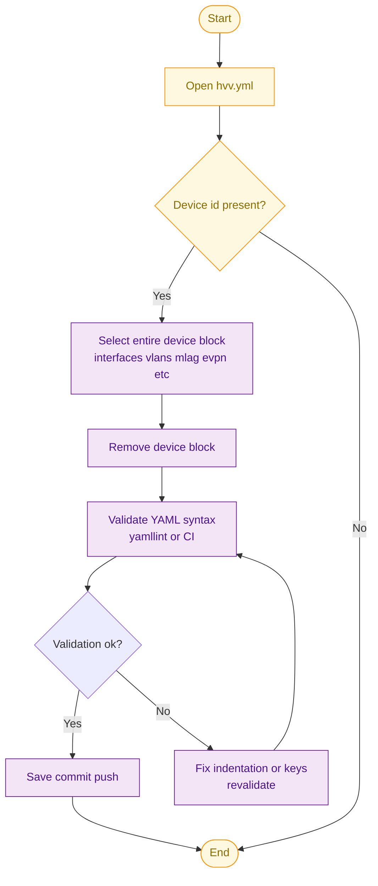

<details>
<summary>🟦 Basic & Interface Commands</summary>

```txt
show run
show version
show boot
show inventory
show environment all
show run | i location
show run | i snmp

show interfaces status
show interfaces counters errors
show interfaces status conn
show ip int brief
show ip int brief | ex un
show int status connected
show standby all
show standby br
show lacp counters
show processes cpu sorted
show processes cpu history
show processes memory sorted
show logging
show interfaces counters protocol status
show etherchannel summary

show interface Ethernet49
show interface Ethernet49 transceiver detail
show interfaces ethernet 49 counters
show interfaces ethernet 49 status
show log | i Ethernet49
show int Et1/3 | include protocol|Full-duplex|Up|rate|CRC|counters
show int GigabitEthernet0 | i rate

show lldp neighbors
show mac address-table
show mac address-table vlan2034
show mac address-table vlan 3513

show spanning-tree
show spanning-tree detail

show vlan 2059
show bridge-domain 3059
show interface BDI3059

show archive log config all

```

# Physical Troubleshooting – GOOD vs BAD Matrix

| Check | GOOD | BAD |
|------|------|------|
| Interface state | connected | notconnect, err-disabled, sfpAbsent |
| Errors | 0 | >0 |
| Discards | 0 | >0 |
| Utilization | <70% sustained | >90% sustained |
| MACs | 1 | >1 or flapping |
| STP | edge, forwarding | non-edge / transitions |
| Transceiver | normal | low Rx / high temp |
| Cable TDR | normal | open/short/mismatch |
| CPU | <20% avg | >70% sustained |
| Broadcast/Multicast | low | very high |

</details>


<details>
<summary>🟩 MLAG / VXLAN‑EVPN Commands</summary>

```txt
show mlag
show mlag config-sanity
show mlag interfaces

show interface Vxlan1
show vxlan controller status

Show vxlan address-table [mac]
show vxlan address-table | inc 0008

show bgp evpn summary

show bgp evpn vrf CUSTOMER_0468
show bgp evpn vni 3014680
show bgp evpn vni 2031000
sh bgp evpn rd 16:2037

show bgp l2vpn evpn sum
show ip bgp l2vpn evpn rd 7:2016
show ip bgp l2vpn evpn rd 7:3016
show bgp l2vpn evpn neighbors 198.19.251.122 advertised-routes | sec CUSTOMER_0080 [Note: core peer: 198.19.251.122]
show bgp l2vpn evpn route-target 17:3120 detail


show platform xp stat
show run nve1
sh interfaces nve1 | include drops

show ip bgp summary
show nve vni interface nve 1 | i 3059

Sh run | s PRIO
```

</details>


<details>
<summary>🟨 VRF / Routing / BGP / CUSTOMER VRF Commands</summary>

```txt
show vrf CUSTOMER_0059
show run | s CUSTOMER_0059
show run vrf CUSTOMER_0059

show ip route vrf CUSTOMER_0376
show run sec vrf CUSTOMER_0059

show running-config interface Vlan2059
show interfaces Vlan2059 status
show ip interface Vlan2059 vrf CUSTOMER_0059

show running-config | in ip route vrf CUSTOMER_0059
show run int nve1 | i CUSTOMER_0059

show ip bgp vpnv4 vrf CUSTOMER_0059
Show ip bgp vpnv4 all summary | inc <ip>
Show ip bgp ipv4 unicast summary | inc <ip>


ping vrf CUSTOMER_0059 100.77.101.2
show ip arp vrf CUSTOMER_0059 100.77.101.2

show bgp vpnv4 unicast vrf CUSTOMER_0059 summary
show ip bgp vpnv4 vrf CUSTOMER_0059 neighbors 100.77.101.2 advertised-routes
show ip bgp vpnv4 vrf CUSTOMER_0059 neighbors 100.77.101.2 received-routes

show run | s OLH
show run | s CUST0265_OLH_FILTER

show ip prefix-list CUST0265_OLH_FILTER_IN
show ip prefix-list CUST0265_OLH_FILTER_OUT
show route-map CUST0265_OLH_FILTER_IN
show route-map CUST0265_OLH_FILTER_OUT

show ip extcommunity-list CL-EVPN-PRIO1 | i 3016
show ip extcommunity-list CL-EVPN-PRIO2 | i 3016

## Arista WAN
show bgp vrf CUSTOMER_0059
show ip bgp neighbors 10.255.15.33 vrf CUSTOMER_0031
show ip bgp neighbors 10.255.12.5 received-routes vrf CUSTOMER_0075
show ip bgp neighbors 10.255.12.5 advertised-routes vrf CUSTOMER_0075
show ip bgp summary vrf CUSTOMER_0024
```

</details>


<details>
<summary>🧱 IPSEC S2S VPN Commands</summary>

```txt
show crypto isakmp sa count
show cry isakmp peers
show crypto ikev2 stats
show crypto ipsec sa count
show run | s proposal
show run | s policy

show run vrf CUSTOMER_0103
show ip route vrf CUSTOMER_0103

show interface Tunnel3103006
show run interface Tunnel3103006

show crypto ipsec profile IPSEC_CUSTOMER_0103_3103006
show crypto ikev2 profile IKEProf_CUSTOMER_0103

show ip access-lists ACL_CUSTOMER_0103_3103006
show crypto ikev2 sa remote 46.182.144.198 detailed
show crypto session remote 46.182.144.198 detail
show crypto session ivrf CUSTOMER_0103 detail

show crypto isakmp sa detail vrf CUSTOMER_0082
sh crypto ipsec sa interface Tunnel3270003
show crypto session remote 18.185.26.239 detail
show crypto session ivrf CUSTOMER_0088 detail
show crypto ipsec sa vrf CUSTOMER_0199 detail

show crypt session remote 185.22.68.101
show crypto ikev2 sa remote 216.252.177.11 detail
show crypto ikev2 sa detailed | s PEER_IP

show run | s AES256_SHA2_Tunnel
sh run | sec crypto *.*(TMP|99)
SHow run | s VPN.*(customer_num)
show crypto ipsec sa detail | s PEER_IP
show crypto isakmp sa detail | s 94.100.246.174

show ip prefix-list CUST0017_QPE_FILTER_TUN4_IN
show ip prefix-list CUST0017_QPE_FILTER_TUN4_OUT
show route-map CUST0017_QPE_FILTER_TUN4_IN
show route-map CUST0017_QPE_FILTER_TUN4_OUT

## Internet VRF
ping vrf INTERNET 113.161.198.112 source port-channel 10.940
traceroute vrf INTERNET 115.75.139.254 source port-channel 10.940

sh crypto session fvrf INTERNET br | i UA
show crypto session detail | i Profile|status|Peer
show cry session fvrf INTERNET | i status|Peer
show crypto isakmp sa detail vrf CUSTOMER_0079

## DEBUG / FIA TRACE
debug crypto condition peer ipv4 216.252.177.11
debug crypto ikev2
debug crypto ikev2 error
debug crypto ikev2 packet
Show log
undebug all

debug platform condition ipv4 190.166.123.2/32 both
debug platform condition start
debug platform packet-trace packet 8192 fia-trace
debug platform packet-trace copy packet both size 2048
clear platform condition all
show platform packet-trace summary
show platform packet-trace packet <packet number>
show platform hardware crypto-device statistics
Show crypto accelerator statistic
show run | sec (crypto|interface.*Tunnel|ip.*access-list.*extended|address-family|prefix-list|route-map).*(0120|EKZ)
```

</details>

<details>
<summary> 🟪 F5 loadbalancer CLI Commands</summary>

```txt
list ltm virtual | grep CRL|grep virtual
list ltm | grep CRL|grep data-group
list ltm virtual CUST0400_HEC01_GMW_Internet_Gateway_iApp
list ltm snatpool CUST0400_HEC01_GMW_Internet_Gateway_iApp
show sys connection ss-client-addr 169.145.99.3
show sys connection cs-client-addr 10.46.8.131%2041
show sys connection virtual-server CUST0041_HEC03_CRL_Internet_Gateway_iApp
show sys connection virtual-server CUST0041_HEC03_CRL_Internet_Gateway_iApp | grep 10.46.8.131
show net
show net trunk
list net trunk
show cm traffic-group
#Note: CRL is Customer-id(CID)
```

</details>

<details>
<summary> 🟥Linux Commands</summary>

```txt
lscpu
ifconfig
tcpdump -i eth1 host hec01v091828 and \( port 30240 or port 30241 \) -w hec01v091828.pcap
tcpdump -nni any host <dip>
tcpdump -nni any port <port>
Ping IP/hostname || Ping IP/hostname -c 100  | c5353614@hec03v033344:~> ping 10.46.1.254 | c5353614@hec03v033344:~> ping proxy
virtualip list
arp -n <ip>
df -h ( from where we can see the filer , we can also ping & then we can get mac of Filer using arp -n <ip>)
ip a
ip route
ip neigh  ===> to check the ARP table
ping proxy / telnet 10.46.1.254 3128  #3128 is port number for squid
telnet hec01v091828 30240
telnet <dip> 25 -b <vhst>
route -n
sudo traceroute -Tp 465 mail.shangrila.com.pk
telnet djrcfeed.dowjones.com 443
tic_info
ping proxy
curl -vx vhmihrotgwc:3128 https://djrcfeed.dowjones.com
curl -vx proxy:3128 https://eu10-004.alm.cloud.sap
curl -v https://connectivitycertsigning.hana.ondemand.com
netstat -tulnp        (use grep for filter port)
tcpdump -vvv -i any -w /install/tcpdumps.pcap host 10.12.128.27 and port 25
nc -vz hec03v044119c 44300

cd /var/log
tail -f /var/log/squid/access.log

## Note:
----------------------------------------------------
HEC1.0: has 3xinterfaces (Core, Storage, Mgmt (APP-MGMT81/V160))
HEC2.0: have 2xInterfaces (1 core, 1 storage)

Squid proxy = Forward proxy = VM ====Google.com 
Web Dispatcher = Reverse proxy==Outsider==core====sap applicaltion

```

</details>

<details>
<summary> 🟫Arista Reboot Commands</summary>

```txt
#Pre-checks:
show maintenance profiles interface default
show maintenance summary
show maintenance

show run
show version 
show boot 
show inventory 
show environment all
show interfaces status 
show lldp neighbors
show mac address-table  
show mlag 
show mlag config-sanity 
show mlag interfaces 
show ip int brief
show ip bgp summary 
show bgp evpn summary 
show lacp counters all-ports
show processes top once 
show logging threshold critical 
show interfaces counters errors
show interfaces status conn
show spanning-tree
show spanning-tree detail
show interface Vxlan1 
show vxlan controller status 
show platform xp stat


#Implementation_step: Step 1: Drain the Switch
conf t
drain
maintenance
profile interface threshold 
rate-monitoring threshold 200000/default
exit
reload

>>>once it come back we have to 
Undrain

# If alias isn't configured
alias drain
   10 configure
   20 maintenance
   30 unit System
   40 quiesce
   50 end
!
alias undrain
10 configure
20 no maintenance
30 end

# If normally unable to go inside the maintenance mode

conf t
maintenance
profile interface threshold
rate-monitoring threshold 100
profile interface threshold default
exit

# Drain:
When you put a device into maintenance mode (via drain), it signals the system to gracefully stop forwarding traffic. This is typically done before performing maintenance or rebooting, so the switch doesn’t disrupt live traffic.

# Undrain:
This command removes the device from maintenance mode, allowing it to resume normal traffic forwarding. Essentially, it reverses the drain state.
```

</details>

<details>
<summary>🔷 Arista DECOM Physical Commands</summary>

```txt
Terminal length 0
show runn
sh int status
sh lldp nei
sh int Ma1 status
sh spanning-tree
sh port-channel summary
sh clock
Sh interface ethernet 40

# Non-working ssh-hostname Login process:

nterm sw-hec05-219.tyo.hec.sap.biz
ssh 10.192.16.99 -p 1005
telnet 10.192.16.99 1005
ssh sw-hec01-962.hec  -l admin

For console access we can check CCIR "own Internal IP" in port information and do ssh admin@1.1.1.1

# Physically reset the device using Aboot after rebooting
# Enter Ctrl-C when prompted early in the boot process.

Aboot#fullrecover                                       # Factory-reset

# All data on /mnt/flash will be erased; type "yes" and press Enter to proceed, or just press Enter to cancel:
# Enter yes and press the Enter key.

# The switch performs one of the following actions:
# - Erases the contents of /mnt/flash.
# - Writes new boot-config, startup-config, and EOS.swi files to /mnt/flash.
# - Returns to the Aboot prompt.
# Exit Aboot. The switch reboots.

Reset system storage secure                              # Erase startup-config process-1
erase startup -config                                    # Erase startup-config process-2
reload
```
</details>

<details>
<summary>🧿 Arista DECOM Manual(PR|CVP) Process</summary>

## For connected neighbor device if not part of decom ( using Show lldp neigh )
Eg: sw-hec10-ipmi-0x

  - Ethernet49
  - description: "Free"
  - shutdown: true

## To avoid Incident-alerts for interfaces which are not in Production
description: "nomon

#### 1) cv_data/hecxx/configlets.yml → Remove decom device entry From Inventory 

Hec DC---> configlets.yml-----> remove the decom device entry from configlet
eg:   
  - sw-hecxx-hvv-02a
  - sw-hecxx-hvv-02b

#### 2) cv_data/hecxx/hvv.yml → Search device and remove full config block for Decom ( 



</details>


<details>
<summary>🧿 Cisco Replacing CLI | Process</summary>

```txt
show version 
show boot 
show inventory 
show platform
show environment all
show ip int brief
show lldp neighbors
show run
show interface summary
show interfaces description
show file system
dir bootflash:
dir harddisk:

show ip protocols
sh ip bgp summary
sh ip bgp all summary

show standby all
show standby br
show lacp counters
show processes cpu sorted
show processes cpu history
show processes memory sorted
show logging
show interfaces counters protocol status
show etherchannel summary
sh ip ospf neighbor
sh ip ospf database
sh ip bgp summary
sh ip bgp all summary
show lldp neighbor
show cdp neighbor
show interface summary
show interfaces description
show standby all
show standby br

## Compare with outputs before the change **

show ip protocols
sh ip bgp summary
sh ip bgp all summary

show standby all
show standby br
show lacp counters
show processes cpu sorted
show processes cpu history
show processes memory sorted
show logging
show interfaces counters protocol status
show etherchannel summary
```

</details>
