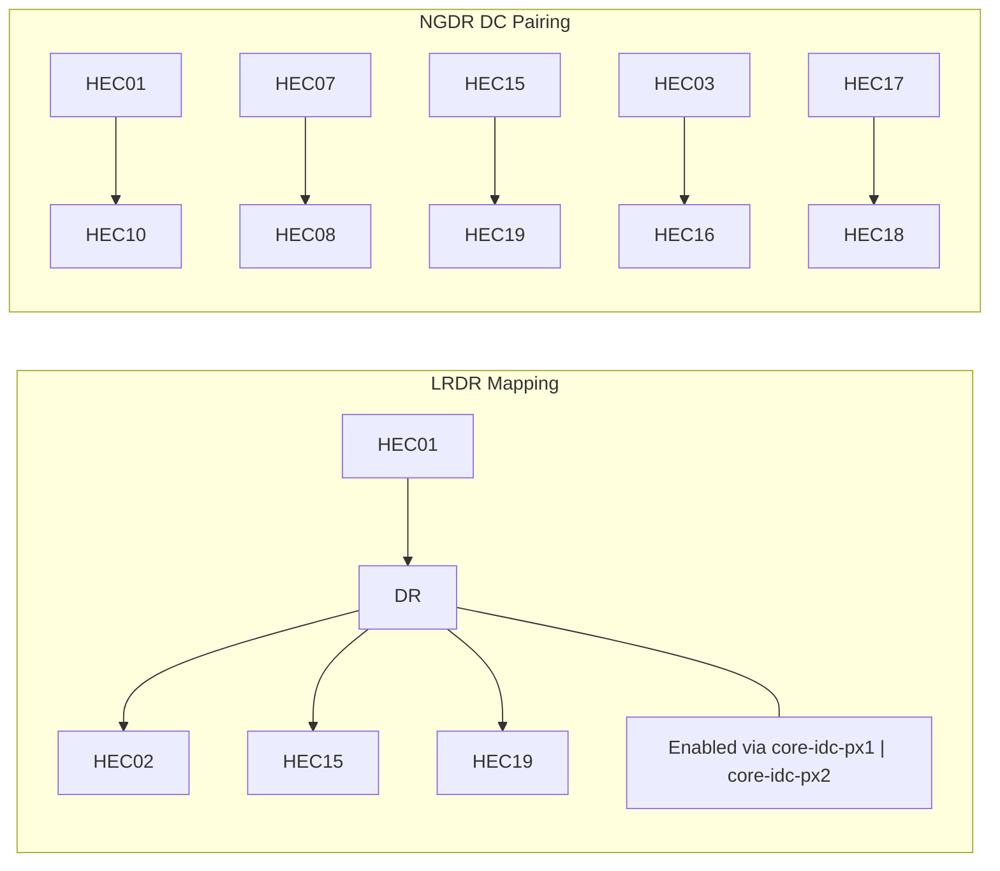

## NGDR & LRDR 

```mermaid
flowchart LR
    %% ===========================
    %% LRDR SECTION
    %% ===========================
    subgraph LRDR["LRDR Mapping"]
        A01["HEC01"] --> DR["DR"]
        DR --> A02["HEC02"]
        DR --> A15["HEC15"]
        DR --> A19["HEC19"]

        NOTE["Enabled via core-idc-px1 | core-idc-px2"]
        DR --- NOTE
    end
    %% ===========================
    %% NGDR SECTION
    %% ===========================
    subgraph NGDR["NGDR DC Pairing"]
        N01["HEC01"] --> N10["HEC10"]
        N07["HEC07"] --> N08["HEC08"]
        N15["HEC15"] --> N19["HEC19"]
        N03["HEC03"] --> N16["HEC16"]
        N17["HEC17"] --> N18["HEC18"]
    end
```
