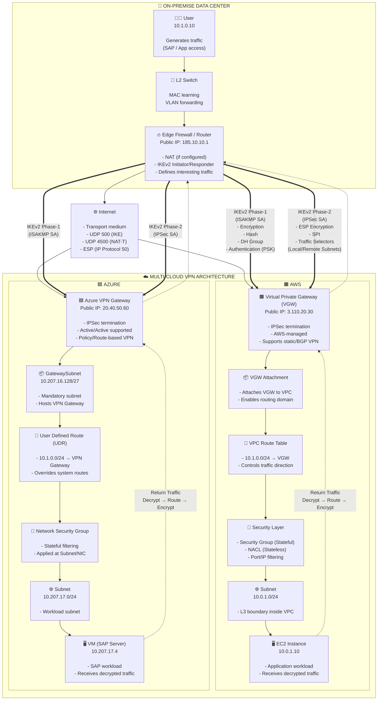

## 🟧 AWS Networking Components (CCIE-Level)
| Component | What is it | Why we need it | Use Case | CCIE Notes |
|----------|------------|----------------|----------|------------|
| VPC (Virtual Private Cloud) | Logical isolated network in AWS | To create private cloud network | Hosting applications securely | Similar to VRF in networking |
| Subnet | L3 segmentation inside VPC | To divide network into smaller segments | App tier separation (web/app/db) | AZ-specific (important for HA) |
| Internet Gateway (IGW) | Gateway for internet access | To allow inbound/outbound internet traffic | Public web servers | Requires public IP + route |
| NAT Gateway | Outbound internet for private subnet | To allow internet without exposing servers | Patch/update servers | One-way traffic (no inbound) |
| Route Table | Defines traffic path | Controls routing inside VPC | Send traffic to IGW/VGW | Longest prefix match logic |
| Security Group (SG) | Stateful firewall | Controls instance-level traffic | Allow HTTP/SSH | Return traffic auto allowed |
| NACL (Network ACL) | Stateless subnet firewall | Additional security layer | Block specific IP ranges | Needs explicit allow both ways |
| VGW (Virtual Private Gateway) | VPN endpoint on AWS side | Terminate IPSec VPN | Site-to-Site VPN | Supports BGP & static |
| Customer Gateway (CGW) | On-prem device representation | Defines peer device | Firewall/router config | Just logical object in AWS |
| Site-to-Site VPN | IPSec tunnel over internet | Secure connectivity to on-prem | Hybrid cloud | Uses IKEv2 + ESP |
| Transit Gateway (TGW) | Hub router for VPCs | Centralized connectivity | Multi-VPC architecture | Like MPLS core router |
| VPC Peering | Direct VPC connection | Connect 2 VPCs | Small environments | No transitive routing |
| Direct Connect | Dedicated private link | Low latency & stable connection | Enterprise workloads | Like leased line/MPLS |
| Elastic IP | Static public IP | Persistent public addressing | NAT / Firewall | Needed for fixed endpoint |
| ENI (Elastic Network Interface) | Virtual NIC | Attach multiple IPs/interfaces | Multi-homing | Supports security groups |
| Load Balancer (ALB/NLB) | Traffic distribution | High availability | Web/app scaling | L7 (ALB), L4 (NLB) |

## 🟦 Azure Networking Components (CCIE-Level)
| Component | What is it | Why we need it | Use Case | CCIE Notes |
|----------|------------|----------------|----------|------------|
| VNet (Virtual Network) | Azure private network | Isolated cloud network | Hosting apps securely | Equivalent to AWS VPC |
| Subnet | Network segmentation | Divide workloads | App tier separation | Required for NSG/UDR |
| Azure VPN Gateway | IPSec VPN endpoint | Secure on-prem connectivity | Site-to-Site VPN | Supports Active/Active |
| GatewaySubnet | Dedicated subnet | Hosts VPN Gateway | Mandatory requirement | Cannot deploy anything else |
| Local Network Gateway | On-prem representation | Define remote site | Peer definition | Like AWS CGW |
| NSG (Network Security Group) | Stateful firewall | Control traffic at subnet/NIC | Allow/deny rules | Similar to SG |
| UDR (User Defined Route) | Custom routing table | Override default routing | Force traffic via firewall | Important for inspection |
| Azure Firewall | Managed firewall | Central security control | Hub-spoke architecture | L7 filtering supported |
| Load Balancer | L4 load balancing | High availability | Backend distribution | Internal/External |
| Application Gateway | L7 load balancer | Web traffic routing | WAF + HTTPS | Like AWS ALB |
| VNet Peering | Connect VNets | Low latency connectivity | Same region/global | No gateway needed |
| ExpressRoute | Private dedicated link | Reliable connectivity | Enterprise DC integration | Like AWS Direct Connect |
| Public IP | Internet-facing IP | External access | Web apps | Static/Dynamic |
| NIC | Network interface | Attach to VM | IP + NSG binding | Like ENI |

## 🔐 VPN vs Private Connectivity (AWS & Azure)
| Feature | VPN (IPSec) | AWS Direct Connect | Azure ExpressRoute |
|--------|------------|-------------------|--------------------|
| Medium | Internet | Private link | Private link |
| Security | Encrypted (IPSec) | Not encrypted by default | Not encrypted by default |
| Latency | Higher / Variable | Low / Stable | Low / Stable |
| Cost | Low | High | High |
| Setup Time | Fast | Slow | Slow |
| Use Case | Quick hybrid setup | Enterprise production | Enterprise production |
| Reliability | Depends on internet | SLA-backed | SLA-backed |

