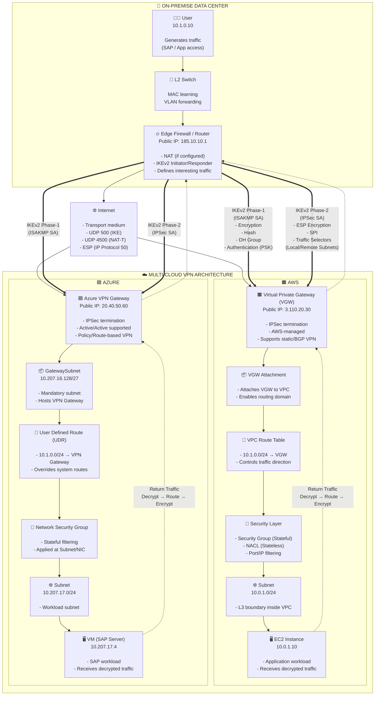

```mermaid
flowchart TB
%% ================= ON-PREM =================
subgraph ONPREM["🏢 ON-PREMISE DATA CENTER"]
   U["👨‍💻 User\n10.1.0.10\n\nGenerates traffic\n(SAP / App access)"]
   SW["🧱 L2 Switch\n\nMAC learning\nVLAN forwarding"]
   FW["🔥 Edge Firewall / Router\nPublic IP: 185.10.10.1\n\n- NAT (if configured)\n- IKEv2 Initiator/Responder\n- Defines interesting traffic"]
   U --> SW --> FW
end
%% ================= INTERNET =================
INET["🌐 Internet\n\n- Transport medium\n- UDP 500 (IKE)\n- UDP 4500 (NAT-T)\n- ESP (IP Protocol 50)"]
FW --> INET
%% ================= CLOUD =================
subgraph CLOUD["☁️ MULTI-CLOUD VPN ARCHITECTURE"]
   direction LR
   %% ================= AWS =================
   subgraph AWS["🟧 AWS"]
       direction TB
       AWS_GW["🟧 Virtual Private Gateway (VGW)\nPublic IP: 3.110.20.30\n\n- IPSec termination\n- AWS-managed\n- Supports static/BGP VPN"]
       AWS_ATTACH["📦 VGW Attachment\n\n- Attaches VGW to VPC\n- Enables routing domain"]
       AWS_RT["🧠 VPC Route Table\n\n- 10.1.0.0/24 → VGW\n- Controls traffic direction"]
       AWS_SEC["🔐 Security Layer\n\n- Security Group (Stateful)\n- NACL (Stateless)\n- Port/IP filtering"]
       AWS_SUB["🌐 Subnet\n10.0.1.0/24\n\n- L3 boundary inside VPC"]
       AWS_EC2["🖥️ EC2 Instance\n10.0.1.10\n\n- Application workload\n- Receives decrypted traffic"]
       AWS_GW --> AWS_ATTACH --> AWS_RT --> AWS_SEC --> AWS_SUB --> AWS_EC2
   end
   %% ================= AZURE =================
   subgraph AZURE["🟦 AZURE "]
       direction TB
       AZ_GW["🟦 Azure VPN Gateway\nPublic IP: 20.40.50.60\n\n- IPSec termination\n- Active/Active supported\n- Policy/Route-based VPN"]
       AZ_GWSUB["📦 GatewaySubnet\n10.207.16.128/27\n\n- Mandatory subnet\n- Hosts VPN Gateway"]
       AZ_RT["🧠 User Defined Route (UDR)\n\n- 10.1.0.0/24 → VPN Gateway\n- Overrides system routes"]
       AZ_NSG["🔐 Network Security Group\n\n- Stateful filtering\n- Applied at Subnet/NIC"]
       AZ_SUB["🌐 Subnet\n10.207.17.0/24\n\n- Workload subnet"]
       AZ_VM["🖥️ VM (SAP Server)\n10.207.17.4\n\n- SAP workload\n- Receives decrypted traffic"]
       AZ_GW --> AZ_GWSUB --> AZ_RT --> AZ_NSG --> AZ_SUB --> AZ_VM
   end
end
%% ================= CONNECTIVITY =================
INET --> AWS_GW
INET --> AZ_GW
%% ================= IKE/IPSEC =================
FW ==>|"IKEv2 Phase-1\n(ISAKMP SA)\n- Encryption\n- Hash\n- DH Group\n- Authentication (PSK)"| AWS_GW
FW ==>|"IKEv2 Phase-2\n(IPSec SA)\n- ESP Encryption\n- SPI\n- Traffic Selectors\n(Local/Remote Subnets)"| AWS_GW
FW ==>|"IKEv2 Phase-1\n(ISAKMP SA)"| AZ_GW
FW ==>|"IKEv2 Phase-2\n(IPSec SA)"| AZ_GW
%% ================= RETURN FLOW =================
AWS_EC2 -.->|"Return Traffic\nDecrypt → Route → Encrypt"| AWS_GW
AZ_VM -.->|"Return Traffic\nDecrypt → Route → Encrypt"| AZ_GW
AWS_GW -.-> FW
AZ_GW -.-> FW
```
