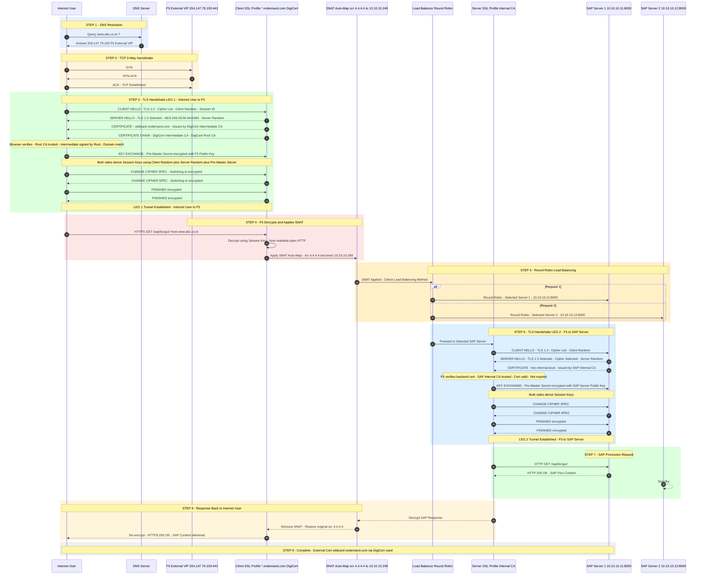

```mermaid
sequenceDiagram
   autonumber
   participant U as Internet User
   participant DNS as DNS Server
   participant VIP as F5 External VIP 204.147.79.100:443
   participant CSSL as Client SSL Profile *.ondemand.com DigiCert
   participant SNAT as SNAT Auto-Map src 4.4.4.4 to 10.10.10.249
   participant PERS as Load Balancer Round Robin
   participant SSSL as Server SSL Profile Internal CA
   participant SAP1 as SAP Server 1 10.10.10.11:8000
   participant SAP2 as SAP Server 2 10.10.10.12:8000
   rect rgb(230, 240, 255)
       Note over U,DNS: STEP 1 - DNS Resolution
       U->>DNS: Query www.abc.co.in ?
       DNS-->>U: Answer 204.147.79.100 F5 External VIP
   end
   rect rgb(255, 245, 220)
       Note over U,VIP: STEP 2 - TCP 3-Way Handshake
       U->>VIP: SYN
       VIP-->>U: SYN-ACK
       U->>VIP: ACK - TCP Established
   end
   rect rgb(220, 255, 220)
       Note over U,CSSL: STEP 3 - TLS Handshake LEG 1 - Internet User to F5
       U->>CSSL: CLIENT HELLO - TLS 1.3 - Cipher List - Client Random - Session ID
       CSSL-->>U: SERVER HELLO - TLS 1.3 Selected - AES-256-GCM-SHA384 - Server Random
       CSSL-->>U: CERTIFICATE - wildcard ondemand.com - Issued by DigiCert Intermediate CA
       CSSL-->>U: CERTIFICATE CHAIN - DigiCert Intermediate CA - DigiCert Root CA
       Note over U: Browser verifies - Root CA trusted - Intermediate signed by Root - Domain match
       U->>CSSL: KEY EXCHANGE - Pre-Master Secret encrypted with F5 Public Key
       Note over U,CSSL: Both sides derive Session Keys using Client Random plus Server Random plus Pre-Master Secret
       U->>CSSL: CHANGE CIPHER SPEC - Switching to encrypted
       CSSL-->>U: CHANGE CIPHER SPEC - Switching to encrypted
       U->>CSSL: FINISHED encrypted
       CSSL-->>U: FINISHED encrypted
       Note over U,CSSL: LEG 1 Tunnel Established - Internet User to F5
   end
   rect rgb(255, 230, 230)
       Note over VIP,SNAT: STEP 4 - F5 Decrypts and Applies SNAT
       U->>CSSL: HTTPS GET /sap/bc/gui/ Host www.abc.co.in
       CSSL->>CSSL: Decrypt using Session Key - Now readable plain HTTP
       CSSL->>SNAT: Apply SNAT Auto-Map - src 4.4.4.4 becomes 10.10.10.249
   end
   rect rgb(255, 240, 200)
       Note over PERS,SAP2: STEP 5 - Round Robin Load Balancing
       SNAT->>PERS: SNAT Applied - Check Load Balancing Method
       alt Request 1
           PERS->>SAP1: Round Robin - Selected Server 1 - 10.10.10.11:8000
       else Request 2
           PERS->>SAP2: Round Robin - Selected Server 2 - 10.10.10.12:8000
       end
   end
   rect rgb(220, 240, 255)
       Note over SSSL,SAP1: STEP 6 - TLS Handshake LEG 2 - F5 to SAP Server
       PERS->>SSSL: Forward to Selected SAP Server
       SSSL->>SAP1: CLIENT HELLO - TLS 1.3 - Cipher List - Client Random
       SAP1-->>SSSL: SERVER HELLO - TLS 1.3 Selected - Cipher Selected - Server Random
       SAP1-->>SSSL: CERTIFICATE - hec-internal.local - Issued by SAP Internal CA
       Note over SSSL: F5 verifies backend cert - SAP Internal CA trusted - Cert valid - Not expired
       SSSL->>SAP1: KEY EXCHANGE - Pre-Master Secret encrypted with SAP Server Public Key
       Note over SSSL,SAP1: Both sides derive Session Keys
       SSSL->>SAP1: CHANGE CIPHER SPEC
       SAP1-->>SSSL: CHANGE CIPHER SPEC
       SSSL->>SAP1: FINISHED encrypted
       SAP1-->>SSSL: FINISHED encrypted
       Note over SSSL,SAP1: LEG 2 Tunnel Established - F5 to SAP Server
   end
   rect rgb(220, 255, 220)
       Note over SAP1: STEP 7 - SAP Processes Request
       SSSL->>SAP1: HTTP GET /sap/bc/gui/
       SAP1-->>SSSL: HTTP 200 OK - SAP Fiori Content
       SAP2-->>SAP2: Standby
   end
   rect rgb(255, 245, 220)
       Note over U,SNAT: STEP 8 - Response Back to Internet User
       SSSL-->>SNAT: Decrypt SAP Response
       SNAT-->>CSSL: Remove SNAT - Restore original src 4.4.4.4
       CSSL-->>U: Re-encrypt - HTTPS 200 OK - SAP Content delivered
   end
   rect rgb(240, 240, 240)
       Note over U,SAP1: STEP 9 - Complete - External Cert wildcard ondemand.com via DigiCert used
   end
```
