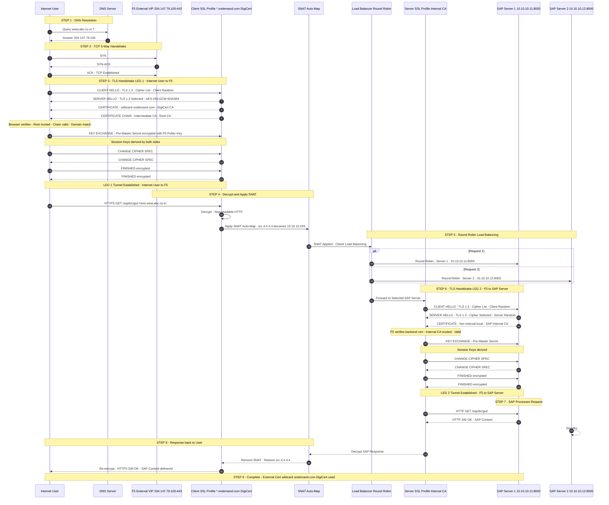

```mermaid
sequenceDiagram
   autonumber
   participant U as Internet User
   participant DNS as DNS Server
   participant VIP as F5 External VIP 204.147.79.100:443
   participant CSSL as Client SSL Profile *.ondemand.com DigiCert
   participant SNAT as SNAT Auto-Map
   participant PERS as Load Balancer Round Robin
   participant SSSL as Server SSL Profile Internal CA
   participant SAP1 as SAP Server 1 10.10.10.11:8000
   participant SAP2 as SAP Server 2 10.10.10.12:8000
   Note over U,DNS: STEP 1 - DNS Resolution
   U->>DNS: Query www.abc.co.in ?
   DNS-->>U: Answer 204.147.79.100
   Note over U,VIP: STEP 2 - TCP 3-Way Handshake
   U->>VIP: SYN
   VIP-->>U: SYN-ACK
   U->>VIP: ACK - TCP Established
   Note over U,CSSL: STEP 3 - TLS Handshake LEG 1 - Internet User to F5
   U->>CSSL: CLIENT HELLO - TLS 1.3 - Cipher List - Client Random
   CSSL-->>U: SERVER HELLO - TLS 1.3 Selected - AES-256-GCM-SHA384
   CSSL-->>U: CERTIFICATE - wildcard ondemand.com - DigiCert CA
   CSSL-->>U: CERTIFICATE CHAIN - Intermediate CA - Root CA
   Note over U: Browser verifies - Root trusted - Chain valid - Domain match
   U->>CSSL: KEY EXCHANGE - Pre-Master Secret encrypted with F5 Public Key
   Note over U,CSSL: Session Keys derived by both sides
   U->>CSSL: CHANGE CIPHER SPEC
   CSSL-->>U: CHANGE CIPHER SPEC
   U->>CSSL: FINISHED encrypted
   CSSL-->>U: FINISHED encrypted
   Note over U,CSSL: LEG 1 Tunnel Established - Internet User to F5
   Note over VIP,SNAT: STEP 4 - Decrypt and Apply SNAT
   U->>CSSL: HTTPS GET /sap/bc/gui/ Host www.abc.co.in
   CSSL->>CSSL: Decrypt - Now readable HTTP
   CSSL->>SNAT: Apply SNAT Auto-Map - src 4.4.4.4 becomes 10.10.10.249
   Note over PERS,SAP2: STEP 5 - Round Robin Load Balancing
   SNAT->>PERS: SNAT Applied - Check Load Balancing
   alt Request 1
       PERS->>SAP1: Round Robin - Server 1 - 10.10.10.11:8000
   else Request 2
       PERS->>SAP2: Round Robin - Server 2 - 10.10.10.12:8000
   end
   Note over SSSL,SAP1: STEP 6 - TLS Handshake LEG 2 - F5 to SAP Server
   PERS->>SSSL: Forward to Selected SAP Server
   SSSL->>SAP1: CLIENT HELLO - TLS 1.3 - Cipher List - Client Random
   SAP1-->>SSSL: SERVER HELLO - TLS 1.3 - Cipher Selected - Server Random
   SAP1-->>SSSL: CERTIFICATE - hec-internal.local - SAP Internal CA
   Note over SSSL: F5 verifies backend cert - Internal CA trusted - Valid
   SSSL->>SAP1: KEY EXCHANGE - Pre-Master Secret
   Note over SSSL,SAP1: Session Keys derived
   SSSL->>SAP1: CHANGE CIPHER SPEC
   SAP1-->>SSSL: CHANGE CIPHER SPEC
   SSSL->>SAP1: FINISHED encrypted
   SAP1-->>SSSL: FINISHED encrypted
   Note over SSSL,SAP1: LEG 2 Tunnel Established - F5 to SAP Server
   Note over SAP1: STEP 7 - SAP Processes Request
   SSSL->>SAP1: HTTP GET /sap/bc/gui/
   SAP1-->>SSSL: HTTP 200 OK - SAP Content
   SAP2-->>SAP2: Standby
   Note over U,SNAT: STEP 8 - Response back to User
   SSSL-->>SNAT: Decrypt SAP Response
   SNAT-->>CSSL: Remove SNAT - Restore src 4.4.4.4
   CSSL-->>U: Re-encrypt - HTTPS 200 OK - SAP Content delivered
   Note over U,SAP1: STEP 9 - Complete - External Cert wildcard ondemand.com DigiCert used
```
