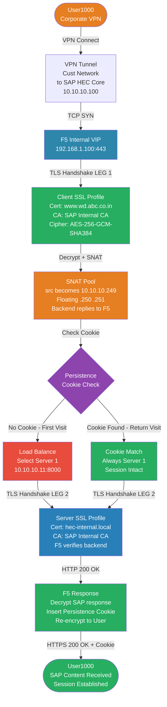

```mermaid
flowchart TD
   A([User1000\nCorporate VPN]) -->|VPN Connect| B
   B[VPN Tunnel\nCust Network\nto SAP HEC Core\n10.10.10.100]
   B -->|TCP SYN| C
   C[F5 Internal VIP\n192.168.1.100:443]
   C -->|TLS Handshake LEG 1| D
   D[Client SSL Profile\nCert: www.wd.abc.co.in\nCA: SAP Internal CA\nCipher: AES-256-GCM-SHA384]
   D -->|Decrypt + SNAT| E
   E[SNAT Pool\nsrc becomes 10.10.10.249\nFloating .250 .251\nBackend replies to F5]
   E -->|Check Cookie| F
   F{Persistence\nCookie Check}
   F -->|No Cookie - First Visit| G[Load Balance\nSelect Server 1\n10.10.10.11:8000]
   F -->|Cookie Found - Return Visit| H[Cookie Match\nAlways Server 1\nSession Intact]
   G -->|TLS Handshake LEG 2| I
   H -->|TLS Handshake LEG 2| I
   I[Server SSL Profile\nCert: hec-internal.local\nCA: SAP Internal CA\nF5 verifies backend]
   I -->|HTTP 200 OK| J
   J[F5 Response\nDecrypt SAP response\nInsert Persistence Cookie\nRe-encrypt to User]
   J -->|HTTPS 200 OK + Cookie| K([User1000\nSAP Content Received\nSession Established])
   style A fill:#E67E22,color:#fff
   style K fill:#27AE60,color:#fff
   style C fill:#2E86AB,color:#fff
   style D fill:#27AE60,color:#fff
   style E fill:#E67E22,color:#fff
   style F fill:#8E44AD,color:#fff
   style G fill:#E74C3C,color:#fff
   style H fill:#27AE60,color:#fff
   style I fill:#2980B9,color:#fff
   style J fill:#27AE60,color:#fff
```
