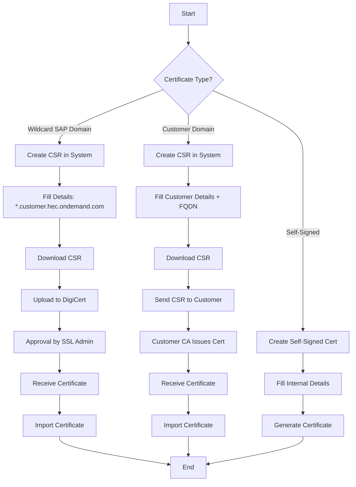
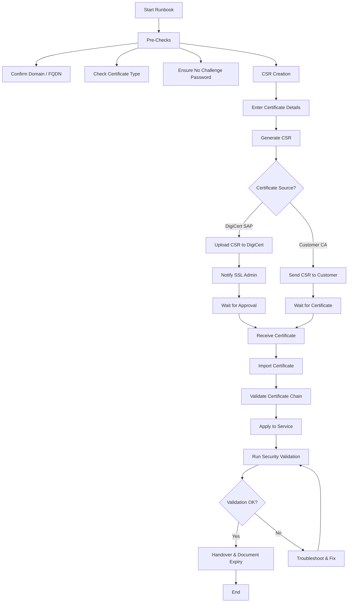

# SSL Certificate Creation on F5 Load Balancers

# 1. Certificate Creation Flow

```mermaid
flowchart TD
    A[Start] --> B{Certificate Type?}

    B -->|Wildcard SAP Domain| C1[Create CSR in System]
    B -->|Customer Domain| C2[Create CSR in System]
    B -->|Self-Signed| C3[Create Self-Signed Cert]

    %% Wildcard Flow
    C1 --> D1[Fill Details: *.customer.hec.ondemand.com]
    D1 --> E1[Download CSR]
    E1 --> F1[Upload to DigiCert]
    F1 --> G1[Approval by SSL Admin]
    G1 --> H1[Receive Certificate]
    H1 --> I1[Import Certificate]
    I1 --> Z[End]

    %% Customer Flow
    C2 --> D2[Fill Customer Details + FQDN]
    D2 --> E2[Download CSR]
    E2 --> F2[Send CSR to Customer]
    F2 --> G2[Customer CA Issues Cert]
    G2 --> H2[Receive Certificate]
    H2 --> I2[Import Certificate]
    I2 --> Z

    %% Self-Signed Flow
    C3 --> D3[Fill Internal Details]
    D3 --> E3[Generate Certificate]
    E3 --> Z
```

---

# 2. Detailed Runbook Flow

```mermaid
flowchart TD
    A[Start Runbook] --> B[Pre-Checks]

    B --> B1[Confirm Domain / FQDN]
    B --> B2[Check Certificate Type]
    B --> B3[Ensure No Challenge Password]
    B --> C[CSR Creation]

    C --> D[Enter Certificate Details]
    D --> E[Generate CSR]

    E --> F{Certificate Source?}

    F -->|DigiCert SAP| G1[Upload CSR to DigiCert]
    G1 --> H1[Notify SSL Admin]
    H1 --> I1[Wait for Approval]

    F -->|Customer CA| G2[Send CSR to Customer]
    G2 --> H2[Wait for Certificate]

    I1 --> J[Receive Certificate]
    H2 --> J

    J --> K[Import Certificate]
    K --> L[Validate Certificate Chain]

    L --> M[Apply to Service]
    M --> N[Run Security Validation]

    N --> O{Validation OK?}
    O -->|Yes| P[Handover & Document Expiry]
    O -->|No| Q[Troubleshoot & Fix]

    Q --> N
    P --> Z[End]
```

---
