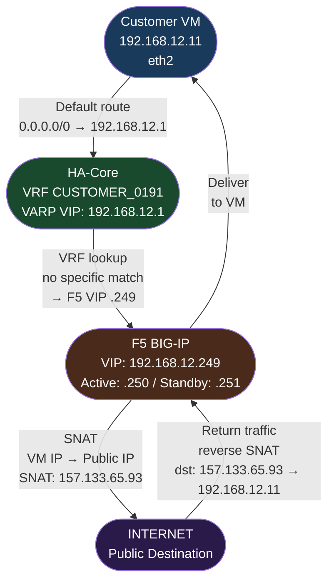
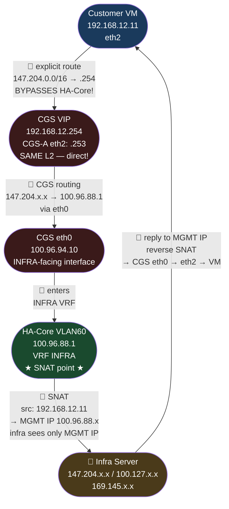
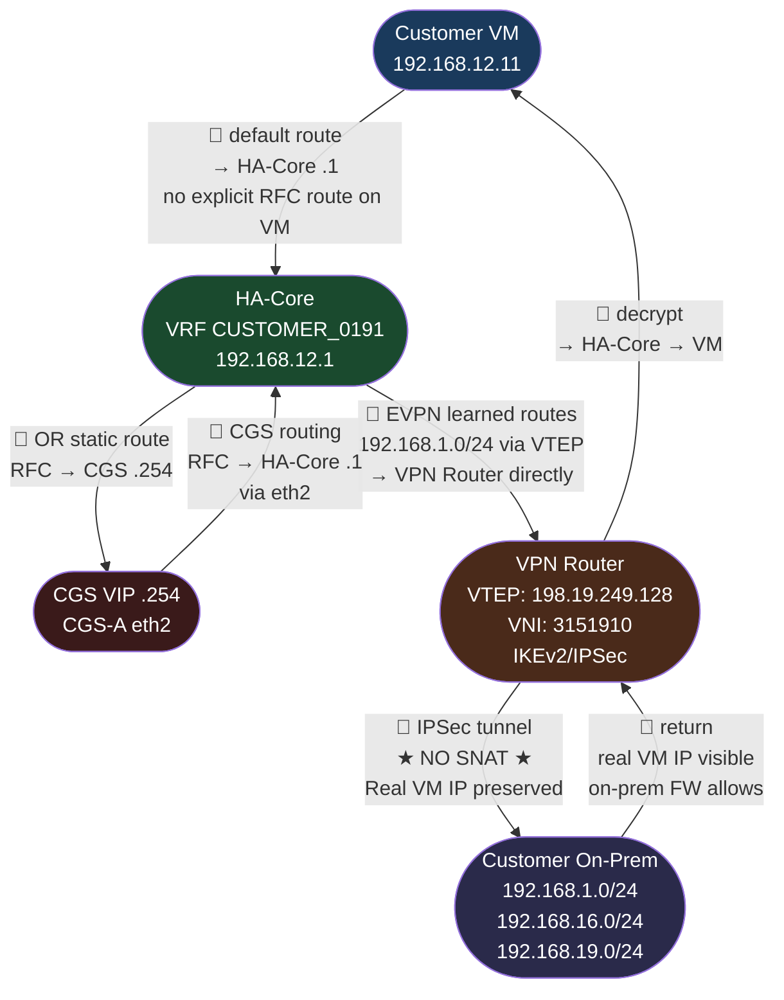
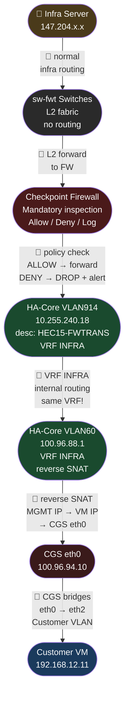
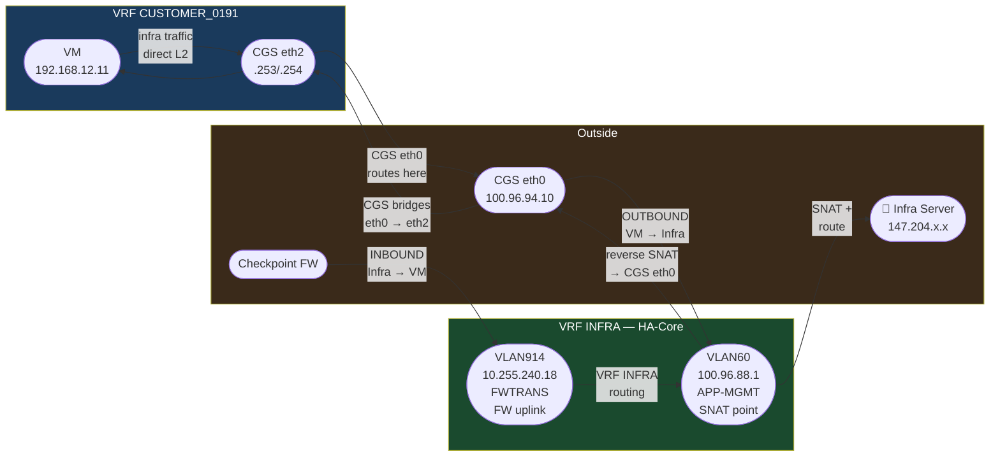
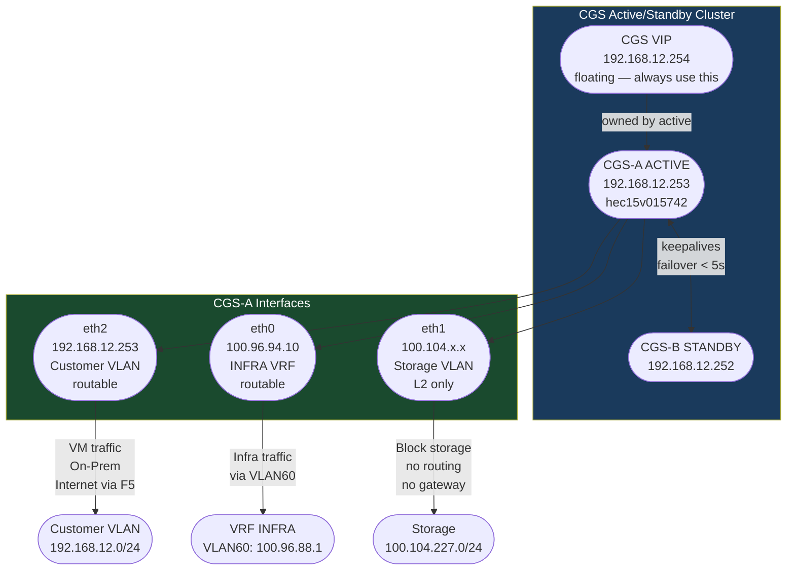
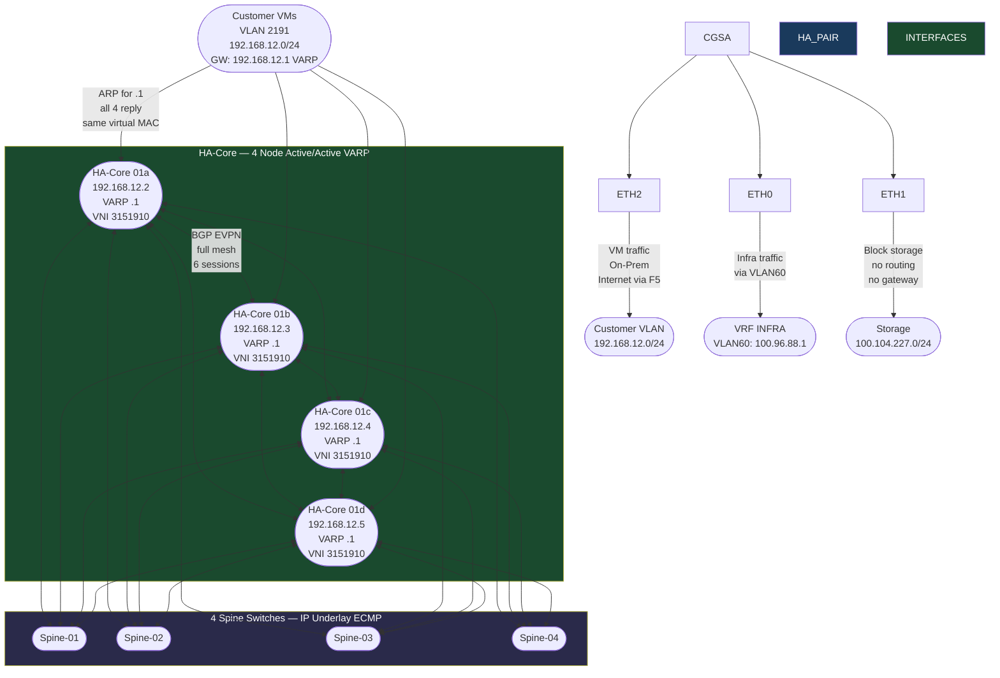
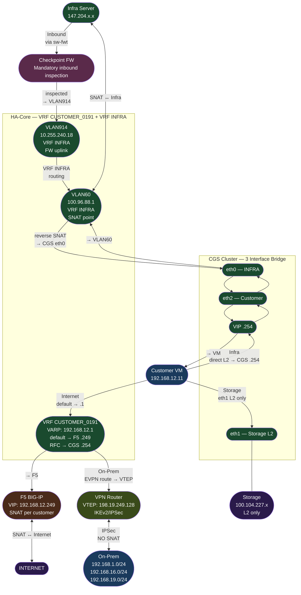

# SAP IaaS Routing Design Documentation

## 📝 SAP HEC
SAP HEC (HANA Enterprise Cloud) is SAP's private managed hosting platform. Unlike AWS or Azure (shared public
cloud), SAP HEC gives each customer a completely dedicated and isolated network slice. Every customer gets their
own VRF (Virtual Routing and Forwarding) on the HA-Core router. A VRF is a completely separate routing table inside
one physical device — two customers on the same HA-Core are completely invisible to each other. This is the
foundation of SAP HEC multi-tenancy.

## Infrastructure & Customer On-Prem Routing

**Scope:** Customer VMs and CGS Servers

---

# 1. Architecture Overview

This document describes the routing design principles for:

* **Customer Customer VMs**
* **Customer Gateway Servers (CGS – Active/Standby)**

The design ensures:

* Controlled Internet breakout
* Strict Infra network isolation
* Deterministic On-Prem routing
* SNAT segregation between Customer and Infra domains
* HA-Core as central L3 decision point

---

# 2.1 High-Level Traffic Domains - Customer VMs

| Traffic Type        | Next Hop             | NAT Behavior             | Control Point         |
| ------------------- | -------------------- | ------------------------ | --------------------- |
| HTTP/HTTPS Internet | F5 (.254) via Squid  | SNAT at F5               | F5 + Internet Routers |
| Non-HTTP Internet   | HA-Core (.1) → F5(.249)    | SNAT at F5               | HA-Core               |
| Infra Networks      | HA-Core (.254)       | SNAT to MGMT IP (VLAN60) | HA-Core (INFRA VRF)   |
| Customer On-Prem    | HA-Core (.1)         | No Internet SNAT         | VPN / CWAN Routers    |

# 2.2 High-Level Traffic Domains - CGS Servers

| Traffic Type        | Next Hop             | NAT Behavior             | Control Point         |
| ------------------- | -------------------- | ------------------------ | --------------------- |
| HTTP/HTTPS Internet | F5 (.249)            | SNAT at F5               | F5 + Internet Routers |
| Non-HTTP Internet   | F5 (.249)            | SNAT at F5               | HA-Core               |
| Infra Networks      | HA-Core (.1 in Vl60) | SNAT to MGMT IP (VLAN60) | HA-Core (INFRA VRF)   |
| Customer On-Prem    | HA-Core (.1)         | No Internet SNAT         | VPN / CWAN Routers    |

---


➡️ Below is the example of HEC15-Customer-OGV-2191
✔ Production network: 192.168.12.0/24
✔ Storage network: 100.104.227.0/24

| Component           | Key IP          | Role / Notes                                      |
|---------------------|-----------------|---------------------------------------------------|
| hec15v015744 VM eth1    | 100.104.227.15/24 | CID-OGV Storage only — L2, no routing   |
| hec15v015744 VM: eth2    | 192.168.12.11   | CID-OGV Main interface — all routable traffic            |
| HA-Core VGW         | 192.168.12.1     | VARP shared GW — all 4 HA-Cores respond          |
| HA-Core 01a         | 192.168.12.2     | CID-OGV example — unique SVI IP, VARP VIP .1         |
| HA-Core 01b         | 192.168.12.3     | CID-OGV example — unique SVI IP, VARP VIP .1         |
| HA-Core 01c         | 192.168.12.4     | CID-OGV example — unique SVI IP, VARP VIP .1         |
| HA-Core 01d         | 192.168.12.5     | CID-OGV example — unique SVI IP, VARP VIP .1         |
| Storag VGW         | 100.104.227.1     | VARP shared GW — all 4 HA-Cores respond          |
| Primary Storage rt  | 100.104.227.2    | CID-OGV example — unique SVI IP, VARP VIP .1         |
| Secondary storage rt | 100.104.227.3   | CID-OGV example — unique SVI IP, VARP VIP .1         |
| CGS VIP             | 192.168.12.254   | CID-OGV CGS Floating IP          |
| CGS-A (ex.Active)   | 192.168.12.253   | CID-OGV Processes all live traffic                       |
| CGS-B (ex.Standby)  | 192.168.12.252   | CID-OGV Hot spare — CGS-A failure takeover               |
| F5 VIP              | 192.168.12.249   | CID-OGV Floating internet LB IP                          |
| F5 SELF IP          | 192.168.12.250   | CID-OGV Self f5 LB IP                          |
| F5 SELF IP          | 192.168.12.251   | CID-OGV Self f5 LB IP                          |
| DNS HOST            | 157.133.65.93    | CID-OGV HEC15-NW-INTERNET : dedicated SNAT 
| CGS INFRA iface     | 198.18.27.146   | CID-OGV CGS eth0 — bridge into VRF INFRA                 |                               |
| HA-Core VLAN60      | 100.96.88.1     |  APP-MGMT : INFRA VRF gateway + SNAT point  |
| HA-Core VLAN914     | 10.255.240.17   | Dedicated Checkpoint FW uplink  |
| HA-Core VLAN900    | 10.255.240.17   | NW-MGMT  |


### ➡️ Lets look at the customer configuration on HA-CORE:
```java
vlan 2191
   name HEC15-CUSTOMER_0191-OGV
!
vrf instance CUSTOMER_0191
   description HEC15-CUSTOMER_0191-OGV
!
interface Vlan2191
   description HEC15-CUSTOMER_0191-OGV
   no autostate
   vrf CUSTOMER_0191
   ip address 192.168.12.2/24
   ip virtual-router address 192.168.12.1
interface Vxlan1
vxlan vlan 2191 vni 2191000
vxlan vrf CUSTOMER_0191 vni 3151910
!
router bgp 64115.10999
   vrf CUSTOMER_0191
      rd 15:2191
      route-target import evpn 15:2191
      route-target import evpn 15:3191
      route-target export evpn 15:2191
      redistribute connected

Gateway of last resort:
 S        0.0.0.0/0 [1/0] via 192.168.12.249, Vlan2191

 S        100.127.0.0/16 [1/0] via 192.168.12.254, Vlan2191
 S        147.204.0.0/16 [1/0] via 192.168.12.254, Vlan2191
 S        169.145.0.0/16 [1/0] via 192.168.12.254, Vlan2191
 B E      192.168.1.0/24 [20/0] via VTEP 198.19.249.128 VNI 3151910 router-mac 70:69:5a:2b:43:3f
 C        192.168.12.0/24 is directly connected, Vlan2191
 B E      192.168.16.0/24 [20/0] via VTEP 198.19.249.128 VNI 3151910 router-mac 70:69:5a:2b:43:3f
 B E      192.168.19.0/24 [20/0] via VTEP 198.19.249.128 VNI 3151910 router-mac 70:69:5a:2b:43:3f
```
### ➡️Lets look at the customer configuration on Storage routers :
```java
interface Vlan2191
   ip address 100.104.227.2/24
   ip access-group 2300 in
   ip virtual-router address 100.104.227.1

interface Vlan2191
   ip address 100.104.227.3/24
   ip access-group 2300 in
   ip virtual-router address 100.104.227.1
```
### ➡️ Lets look at the customer configuration on VM- hec15v015744:
```java
c5353614@hec15v015744:~> ip addr
1: lo: <LOOPBACK,UP,LOWER_UP> mtu 65536 qdisc noqueue state UNKNOWN group default qlen 1000
    link/loopback 00:00:00:00:00:00 brd 00:00:00:00:00:00
    inet 127.0.0.1/8 scope host lo
       valid_lft forever preferred_lft forever
2: eth1: <BROADCAST,MULTICAST,UP,LOWER_UP> mtu 1500 qdisc mq state UP group default qlen 1000
    link/ether 00:50:56:8f:57:aa brd ff:ff:ff:ff:ff:ff
    inet 100.104.227.15/24 brd 100.104.227.255 scope global eth1
       valid_lft forever preferred_lft forever
3: eth2: <BROADCAST,MULTICAST,UP,LOWER_UP> mtu 1500 qdisc mq state UP group default qlen 1000
    link/ether 00:50:56:8f:0e:82 brd ff:ff:ff:ff:ff:ff
    inet 192.168.12.11/24 brd 192.168.12.255 scope global eth2
       valid_lft forever preferred_lft forever
    inet 192.168.12.12/24 brd 192.168.12.255 scope global secondary eth2:vhogvfr
       valid_lft forever preferred_lft forever
       
hec15v015744:~> route -n
Kernel IP routing table
Destination     Gateway         Genmask         Flags Metric Ref    Use Iface
0.0.0.0         192.168.12.1    0.0.0.0         UG    0      0        0 eth2 ====👉Pointing towards VGW: Vlan2191 on HA_CORE routers
100.104.0.0     100.104.227.1   255.255.255.0   UG    0      0        0 eth1 ====👉Pointing towards VGW: Vlan2191 on Storage routers
100.104.227.0   0.0.0.0         255.255.255.0   U     0      0        0 eth1
100.127.0.0     192.168.12.254  255.255.0.0     UG    0      0        0 eth2 ====👉INFRA routes Pointing towards customer CGS
147.204.0.0     192.168.12.254  255.255.0.0     UG    0      0        0 eth2 ====👉INFRA routes Pointing towards customer CGS
169.145.0.0     192.168.12.254  255.255.0.0     UG    0      0        0 eth2 ====👉INFRA routes Pointing towards customer CGS
192.168.12.0    0.0.0.0         255.255.255.0   U     0      0        0 eth2   

```
### ➡️ Lets look at the customer configuration on CGS VM:
```java
c5353614@hec15v015742:~> route -n
Kernel IP routing table
Destination     Gateway         Genmask         Flags Metric Ref    Use Iface
0.0.0.0         192.168.12.249  0.0.0.0         UG    0      0        0 eth2 ====👉Pointing towards LoadBalancer VIP: route-domain CUST0191
10.0.0.0        192.168.12.1    255.0.0.0       UG    0      0        0 eth2
100.96.64.0     0.0.0.0         255.255.224.0   U     0      0        0 eth0
100.96.88.0     0.0.0.0         255.255.248.0   U     0      0        0 eth0
100.104.0.0     100.104.227.1   255.255.255.0   UG    0      0        0 eth1
100.104.227.0   0.0.0.0         255.255.255.0   U     0      0        0 eth1
100.124.64.0    0.0.0.0         255.255.224.0   U     0      0        0 eth0
100.127.0.0     100.96.88.1     255.255.0.0     UG    0      0        0 eth0 ===👉 Pointing APP_MGMT : INFRA= Vlan60 on HA_CORE
147.204.0.0     100.96.88.1     255.255.0.0     UG    0      0        0 eth0 ===👉 Pointing APP_MGMT : INFRA= Vlan60 on HA_CORE
169.145.0.0     100.96.88.1     255.255.0.0     UG    0      0        0 eth0 ===👉 Pointing APP_MGMT : INFRA= Vlan60 on HA_CORE
172.16.0.0      192.168.12.1    255.240.0.0     UG    0      0        0 eth2
192.168.0.0     192.168.12.1    255.255.0.0     UG    0      0        0 eth2
192.168.12.0    0.0.0.0         255.255.255.0   U     0      0        0 eth2

c5353614@hec15v015742:~> ifconfig
eth0      Link encap:Ethernet  HWaddr 00:50:56:8F:D8:0E
          inet addr:100.96.94.10  Bcast:100.96.95.255  Mask:255.255.248.0
          UP BROADCAST RUNNING MULTICAST  MTU:1500  Metric:1
          RX packets:26122335 errors:0 dropped:67 overruns:0 frame:0
          TX packets:25193639 errors:0 dropped:0 overruns:0 carrier:0
          collisions:0 txqueuelen:1000
          RX bytes:8086007417 (7711.4 Mb)  TX bytes:26447240419 (25222.0 Mb)

eth1      Link encap:Ethernet  HWaddr 00:50:56:8F:98:EF
          inet addr:100.104.227.12  Bcast:100.104.227.255  Mask:255.255.255.0
          UP BROADCAST RUNNING MULTICAST  MTU:1500  Metric:1
          RX packets:32462113 errors:0 dropped:1577 overruns:0 frame:0
          TX packets:4766735 errors:0 dropped:0 overruns:0 carrier:0
          collisions:0 txqueuelen:1000
          RX bytes:43713398745 (41688.3 Mb)  TX bytes:12164295767 (11600.7 Mb)

eth2      Link encap:Ethernet  HWaddr 00:50:56:8F:47:1E
          inet addr:192.168.12.253  Bcast:192.168.12.255  Mask:255.255.255.0
          UP BROADCAST RUNNING MULTICAST  MTU:1500  Metric:1
          RX packets:50278506 errors:0 dropped:286991 overruns:0 frame:0
          TX packets:28750968 errors:0 dropped:0 overruns:0 carrier:0
          collisions:0 txqueuelen:1000
          RX bytes:34106558447 (32526.5 Mb)  TX bytes:14761636552 (14077.7 Mb)

lo        Link encap:Local Loopback
          inet addr:127.0.0.1  Mask:255.0.0.0
          UP LOOPBACK RUNNING  MTU:65536  Metric:1
          RX packets:9894842 errors:0 dropped:0 overruns:0 frame:0
          TX packets:9894842 errors:0 dropped:0 overruns:0 carrier:0
          collisions:0 txqueuelen:1000
          RX bytes:12163825137 (11600.3 Mb)  TX bytes:12163825137 (11600.3 Mb)
```
### ➡️ Lets look at the configuration on INFRA:
```java
interface Vlan60
   description ->HEC15-APP-MGMT-01
   no autostate
   vrf INFRA
   ip address 100.96.88.2/21
   ip address 100.124.64.2/19 secondary
   ip access-group 2500 out
   ip virtual-router address 100.96.88.1
   ip virtual-router address 100.124.64.1
!
interface Vlan914
   description ->HEC15-FWTRANS
   no autostate
   vrf INFRA
   ip address 10.255.240.18/28
   ip virtual-router address 10.255.240.17
!
interface Vlan900
   description ->HEC15-NW-MGMT
   no autostate
   vrf INFRA
   ip address 198.19.238.2/24
   ip virtual-router address 198.19.238.1
router bgp 64115.10999
   vrf INFRA
      rd 15:900
      route-target import evpn 15:900
      route-target import evpn 15:3499
      route-target import evpn 19:900
      route-target export evpn 15:900
      redistribute connected route-map RM-INFRA
      redistribute static route-map RM-INFRA
      
ip routing vrf INFRA
ip route vrf INFRA 0.0.0.0/0 Vlan914 10.255.240.28
ip route vrf INFRA 100.104.0.0/15 Vlan922 10.255.240.81
ip route vrf INFRA 100.127.109.184/29 Vlan914 10.255.240.28
ip route vrf INFRA 198.19.224.16/28 Vlan900 198.19.238.8
!
interface Vxlan1
vxlan vlan 60 vni 10060
vxlan vlan 914 vni 10914
vxlan vlan 900 vni 10900
vxlan vrf INFRA vni 9150000
``` 
## 🔴The Five Key Components
### 🟢Component 1 — Customer VM
The actual SAP workload server. Has TWO network interfaces with completely different purposes:
• eth2 (Customer VLAN 192.168.12.0/24): All routable traffic — internet, on-prem, infra. Default gateway is HA-Core
VGW X.X.X.1 .This is where all application traffic flows.

• eth1 (Storage VLAN 100.64.122.0/24): — packets cannot be routed

### 🟢Component 2 — HA-Core (High Availability Core Router/Switch)
The HA-Core is the L3 backbone and the SINGLE routing policy enforcement point in SAP HEC. It is an Arista switch
cluster — four nodes (01a X.X.X.2, 01b X.X.X.3, 01c X.X.X.4, 01d X.X.X.5) connected to 4 Arista Spine(11,12,13,14) switches. all sharing VIP .1 via VARP. 
Every routing decision goes through HA-Core. It runs separate VRF instances per customer (VRF CUSTOMER_0004 for
OGV) plus the shared INFRA VRF for SAP management traffic. 

👉 Think of HA‑Core as: A 4‑lane traffic control center. Always available, always routing

### 🟢Component 3 — CGS (Customer Gateway Server)
The CGS is a virtual Intel Xeon Linux server that is uniquely multi-homed across THREE network domains.
CGS runs Active/Standby (CGS-A and CGS-B) with a shared VIP (.254). All routing tables — both in VMs and in
HA-Core — always point to .254, making failover completely transparent and requiring zero reconfiguration.

Customer network (eth2)
SAP Infra network (eth0)
Storage network (eth1)

👉 Think of CGS as: A triple‑door gateway that connects all isolated networks safely

### 🟢Component 4 — F5 BIG-IP
The F5 handles ALL internet traffic and is the SINGLE SNAT point. Each customer gets a dedicated SNAT IP pool —
OGV traffic always appears from OGV's own public IP, never shared with other customers. F5 runs Active/Standby with
a floating VIP (.249). Failover is transparent to VMs.

### 🟢Component 5 — VPN / CWAN Routers
Connect SAP HEC to the customer's on-premises network. Two redundant paths: VPN Routers using IPSec tunnels
over internet (standard, flexible), and CWAN Routers using dedicated MPLS or cloud peering circuits (guaranteed SLA,
lower latency, higher cost). Both paths are used simultaneously for redundancy.

## The Three Traffic Categories

### 1. Internet == Public IPs
### 2. Infra == 100.127/147.204/169.145
### 3. On-Prem == RFC1918

Note: Non-RFC On-Prem Exception: If customer uses non-RFC IPs at On-Prem (e.g. 140.140.x.x), these are NOT auto-recognized as On-Prem. Traffic falls
to default route => F5

## Flow 1 — Customer VM to Internet (HTTP/HTTPS) : Must use Squid Proxy

#### Non-HTTP/HTTPS (SMTP port 587, SSH port 22, any other port) 
* Routed via Default Gateway: `x.x.x.1` (HA-Core)
* HA-Core forwards to F5 (.249)
* SNAT performed at F5
* Forwarded to Internet Routers
Note: Does NOT go through Squid proxy. Goes directly VM -> HA-Core -> F5 -> Internet. Squid only understands HTTP/HTTPS.

Now let's see the flow:
1. **VM 192.168.12.11** → wants to reach **Google 8.8.8.8**  
   `// VM has no specific route for 8.8.8.8`

2. **VM routing table:** `0.0.0.0/0` → **HA‑Core 192.168.12.1**  
   `// default route catches everything unknown`

3. **HA‑Core VRF CUSTOMER_0191** → route lookup → default →  
   **F5 VIP 192.168.12.249**

4. **F5 Active .250** → **SNAT:** `src 192.168.12.11 → OGV Public IP`  
   `// private IP hidden from internet`

5. **Internet** replies → **F5 reverses SNAT** → **VM receives response**  
   `// VM never knows it was translated`

```java
hec15v015744:~> route -n
Kernel IP routing table
Destination     Gateway         Genmask         Flags Metric Ref    Use Iface
0.0.0.0         192.168.12.1    0.0.0.0         UG    0      0        0 eth2 ====👉Pointing towards VGW: Vlan2191 on HA_CORE routers
100.104.0.0     100.104.227.1   255.255.255.0   UG    0      0        0 eth1 ====👉Pointing towards VGW: Vlan2191 on Storage routers
100.104.227.0   0.0.0.0         255.255.255.0   U     0      0        0 eth1
100.127.0.0     192.168.12.254  255.255.0.0     UG    0      0        0 eth2 ====👉INFRA routes Pointing towards customer CGS
147.204.0.0     192.168.12.254  255.255.0.0     UG    0      0        0 eth2 ====👉INFRA routes Pointing towards customer CGS
169.145.0.0     192.168.12.254  255.255.0.0     UG    0      0        0 eth2 ====👉INFRA routes Pointing towards customer CGS
192.168.12.0    0.0.0.0         255.255.255.0   U     0      0        0 eth2   

✔ Troubleshooting:
 • VM: ping 192.168.12.1 — HA-Core gateway reachable?
 • VM: traceroute 8.8.8.8 — first hop .1 (HA-Core)? Second hop .249 (F5)?
 • F5: Is VIP .249 up? Is SNAT pool configured for this customer VRF?
 • F5 access logs: Is SNAT translation actually occurring?

```
## Flow 2 — Customer VM to Infra Networks(SNAT at VLAN60)

1. **VM 192.168.12.11** → wants to reach **Infra 147.204.100.17**  
   `// explicit route!`

2. **VM routing:** `147.204.0.0/16` → **CGS VIP 192.168.12.254**  
   `// explicit route; HA‑Core bypassed!`

3. **CGS‑A eth2 .253** receives → CGS routing:  
   **147.204.x.x → 100.96.88.1 via eth0**

4. **CGS eth0 100.96.94.10** → **HA‑Core VLAN60 100.96.88.1**  
   `// enters INFRA VRF`

5. **VLAN60** → **SNAT:** `src 192.168.12.11 → MGMT IP 100.96.88.x`  
   `// VM IP hidden from infra servers`

6. **Infra Server** receives → sees only MGMT IP (not VM IP) → replies →  
   reverse SNAT → **VM**
```java
c5353614@hec15v015742:~> route -n
Kernel IP routing table
Destination     Gateway         Genmask         Flags Metric Ref    Use Iface
0.0.0.0         192.168.12.249  0.0.0.0         UG    0      0        0 eth2 ====👉Pointing towards LoadBalancer VIP: route-domain CUST0191
10.0.0.0        192.168.12.1    255.0.0.0       UG    0      0        0 eth2
100.96.64.0     0.0.0.0         255.255.224.0   U     0      0        0 eth0
100.96.88.0     0.0.0.0         255.255.248.0   U     0      0        0 eth0
100.104.0.0     100.104.227.1   255.255.255.0   UG    0      0        0 eth1
100.104.227.0   0.0.0.0         255.255.255.0   U     0      0        0 eth1
100.124.64.0    0.0.0.0         255.255.224.0   U     0      0        0 eth0
100.127.0.0     100.96.88.1     255.255.0.0     UG    0      0        0 eth0 ===👉 Pointing APP_MGMT : INFRA= Vlan60 on HA_CORE
147.204.0.0     100.96.88.1     255.255.0.0     UG    0      0        0 eth0 ===👉 Pointing APP_MGMT : INFRA= Vlan60 on HA_CORE
169.145.0.0     100.96.88.1     255.255.0.0     UG    0      0        0 eth0 ===👉 Pointing APP_MGMT : INFRA= Vlan60 on HA_CORE
172.16.0.0      192.168.12.1    255.240.0.0     UG    0      0        0 eth2
192.168.0.0     192.168.12.1    255.255.0.0     UG    0      0        0 eth2
192.168.12.0    0.0.0.0         255.255.255.0   U     0      0        0 eth2
```
## Flow 3 — VM to On-Premises (No SNAT, via VPN)

## Step-by-Step Flow

1. **VM 192.168.12.11** → wants to reach **On‑Prem 192.168.1.50**

2. VM has no specific route for 192.168.1.x → `0.0.0.0/0` → **HA‑Core 192.168.12.1**

3. **HA‑Core VRF CUSTOMER_0191** → EVPN learned:  
   **192.168.1.0/24 via VTEP 198.19.249.128**

4. **VPN Router VTEP .128** → VXLAN encapsulation (VNI 3151910) →  
   IPsec tunnel → On‑Prem

5. **On‑Prem firewall** sees **real src IP 192.168.12.11** → matches allow rule →  
   **delivered**

6. On‑Prem reply → VPN tunnel → HA‑Core → VM  
   `// return path uses same tunnel, real IP throughout`


---

### ⚠ Important Exception Rule

If Customer uses non-RFC networks at their On-premises:

```
140.140.140.0/24
```

These networks:

* Are NOT automatically treated as On-Prem
* Will be routed to F5 (Internet path)

Therefore:

> MCD SM team must add static route on CGS
> So traffic is routed to HA-Core instead of F5.

Otherwise:

* Traffic incorrectly classified as Internet
* Connectivity failure occurs

---
   
## Flow 4 Infra Server to customer VM (Inbound via Checkpoint FW)

## Step-by-Step Flow

1. **Infra Server 147.204.x.x** → sends packet to **CGS or VM 192.168.12.x**

2. sw‑fwt switches → forward at **L2 toward Checkpoint FW**  
   `// pure switching, no routing`

3. **Checkpoint FW** → inspect policy → ALLOW? forward + log | DENY? DROP + alert

4. FW forwards → **HA‑Core VLAN914 10.255.240.18**  
   `// FW's dedicated door into HA‑Core`

5. **VLAN914** is in VRF INFRA → HA‑Core routes internally →  
   **VLAN60 100.96.88.1**  
   `// same VRF, internal routing`

6. **VLAN60** → reverse SNAT → **CGS eth0 100.96.94.10** → CGS eth2 → Customer VLAN

7. **Customer VM 192.168.12.11** receives packet ✅
## 🔴VLAN60 vs VLAN914 Relationship


## Flow 6 — CGS Active/Standby + 3 Interface Architecture

## Flow 7 — HA-Core 4-Node Active/Active VARP + EVPN

## Flow 8 — Complete Master Flow (All Directions)

## Golden Rules to Remember

| Rule | Detail |
|------|--------|
| <span style="background:#4ea1ff; padding:4px 8px; border-radius:4px; color:#fff;">VM is simple</span> | VM only knows: default → HA‑Core, infra → CGS. That's it. |
| <span style="background:#2ecc71; padding:4px 8px; border-radius:4px; color:#fff;">HA‑Core is the brain</span> | Decides: internet? → F5. On‑Prem? → VPN. Infra? → CGS already handled it. |
| <span style="background:#e67e22; padding:4px 8px; border-radius:4px; color:#fff;">CGS is the bridge</span> | Only device in Customer VRF + INFRA VRF + Storage. No other device crosses these domains. |
| <span style="background:#16a085; padding:4px 8px; border-radius:4px; color:#fff;">VLAN60 = outbound infra door</span> | CGS eth0 connects here. SNAT happens here. Direction: Customer → Infra. |
| <span style="background:#8e44ad; padding:4px 8px; border-radius:4px; color:#fff;">VLAN914 = inbound infra door</span> | Checkpoint FW connects here. Direction: Infra → Customer. Mandatory FW inspection. |
| <span style="background:#c0392b; padding:4px 8px; border-radius:4px; color:#fff;">F5 = only internet SNAT</span> | All internet traffic NAT’d here. Per‑customer dedicated IP pool. |
| <span style="background:#34495e; padding:4px 8px; border-radius:4px; color:#fff;">Never point to .253/.252</span> | Always use CGS VIP .254. Direct to physical CGS breaks failover. |

# 📘 Service & Application Ports Reference

## 🔐 Standard Service Ports

| Service / Protocol | Port | Transport | Meaning |
|--------------------|-------|-----------|---------|
| **SSH** | 22 | TCP | Remote secure shell login (Linux). Used for secure server access. |
| **RDP** | 3389 | TCP | Windows Remote Desktop Protocol for GUI login. |
| **ICMP (Ping)** | N/A | ICMP | No port number; uses ICMP Echo (8) & Reply (0). |
| **FTP** | 21 (control), 20 (data) | TCP | Old file transfer protocol (not encrypted). |
| **SFTP** | 22 | TCP | Secure file transfer (runs over SSH). |
| **SMTP** | 25 | TCP | Mail transfer (Postfix, Sendmail). |
| **SMTP Auth** | 587 | TCP | Secure SMTP submissions with authentication. |
| **SMTPS** | 465 | TCP | SMTP over SSL/TLS. |
| **DNS Query** | 53 | UDP | DNS lookup queries. |
| **DNS Zone Transfer** | 53 | TCP | Secondary DNS servers syncing zone data. |
| **SNMP** | 161 | UDP | Monitoring/polling (Get/Set). |
| **SNMP Trap** | 162 | UDP | Alerts from devices (traps/informs). |

---

## ✔ Custom Application Ports
*(Examples – varies by application)*

| Application | Port | Protocol | Meaning |
|-------------|-------|----------|----------|
| **App Server** | 18081 | TCP | Web/REST testing port. |
| **App Server** | 29000 | TCP | API listener. |
| **App Server** | 31234 | TCP/UDP | Custom application listener. |
