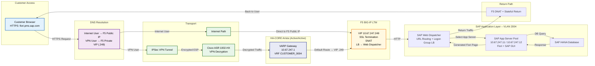

# SAP Fiori Access Flow – Internet and VPN Users

```mermaid
flowchart LR
   %% ───────── CUSTOMER ─────────
   subgraph CUST["Customer Access"]
       BROWSER["Customer Browser<br/>HTTPS: fiori.pms.sap.com"]
   end
   %% ───────── DNS ─────────
   subgraph DNS["DNS Resolution"]
       DNS1["Internet User → F5 Public IP<br/>VPN User → F5 Private VIP (.249)"]
   end
   %% ───────── TRANSPORT ─────────
   subgraph TRANS["Transport"]
       INET["Internet Path"]
       VPN["IPSec VPN Tunnel"]
       ASR["Cisco ASR 1002-HX<br/>VPN Decryption"]
   end
   %% ───────── NETWORK CORE ─────────
   subgraph CORE["HA-CORE Arista (Active/Active)"]
       VARP["VARP Gateway<br/>10.67.247.1<br/>VRF CUSTOMER_0004"]
   end
   %% ───────── F5 ─────────
   subgraph F5B["F5 BIG-IP LTM"]
       F5["VIP 10.67.247.249<br/>SSL Termination<br/>SNAT<br/>LB → Web Dispatcher"]
   end
   %% ───────── APPLICATION ─────────
   subgraph APP["SAP Application Layer – VLAN 2004"]
       WD["SAP Web Dispatcher<br/>URL Routing + Logon Group LB"]
       APPS["SAP App Server Pool<br/>10.67.247.11 / 10.67.247.12<br/>Fiori + SAP GUI"]
       HANA["SAP HANA Database"]
   end
   %% ───────── RETURN ─────────
   subgraph RET["Return Path"]
       RET1["F5 DNAT + Stateful Return"]
   end
   %% ───────── FLOW ─────────
   BROWSER -->|"HTTPS Request"| DNS1
   DNS1 -->|"Internet User"| INET
   DNS1 -->|"VPN User"| VPN
   INET -->|"Direct to F5 Public IP"| F5
   VPN -->|"Encrypted ESP"| ASR
   ASR -->|"Decrypted Traffic"| VARP
   VARP -->|"Default Route → VIP .249"| F5
   F5 -->|"HTTP"| WD
   WD -->|"Select App Server"| APPS
   APPS -->|"DB Query"| HANA
   HANA -->|"Response"| APPS
   APPS -->|"Generated Fiori Page"| WD
   WD -->|"Return Traffic"| RET1
   RET1 -->|"Back to User"| BROWSER
   %% ───────── STYLES ─────────
   classDef cust fill:#E3F2FD,stroke:#1565C0,color:#000,stroke-width:2px
   classDef dns fill:#F3E5F5,stroke:#6A1B9A,color:#000,stroke-width:2px
   classDef trans fill:#E8F5E9,stroke:#2E7D32,color:#000,stroke-width:2px
   classDef core fill:#E8EAF6,stroke:#283593,color:#000,stroke-width:2px
   classDef f5 fill:#FFF8E1,stroke:#F57F17,color:#000,stroke-width:2px
   classDef app fill:#F1F8E9,stroke:#558B2F,color:#000,stroke-width:2px
   classDef db fill:#FCE4EC,stroke:#880E4F,color:#000,stroke-width:2px
   classDef ret fill:#FBE9E7,stroke:#BF360C,color:#000,stroke-width:2px
   class BROWSER cust
   class DNS1 dns
   class INET,VPN,ASR trans
   class VARP core
   class F5 f5
```
   class WD,APPS app
   class HANA db
   class RET1 ret
